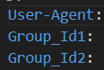

# GET_COMMON_QQ_GROUP_MEMBERS
这份代码用于获取两个QQ群的公共成员

## Usage
# 1.修改配置文件

找到`config.py`文件，修改其中的信息


(1)其中`User-Agent`在你的浏览器开发者工具(f12)中获取


(2)将两个群的qq号填入`Group_Id1`和`Group_Id2`中

# 2.运行并扫码登陆
```bash 
python main.py

```
或使用其它IDE运行, 如pycharm或VScode

扫码登陆


# 3.查看结果

